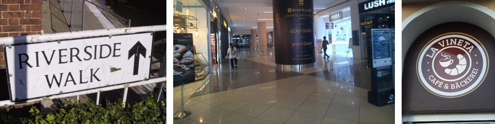

# CRAFT: Character-Region Awareness For Text detection

<p align="center">
<a href="https://pepy.tech/project/craft-text-detector"></a>
<a href="https://pypi.org/project/craft-text-detector"></a>
<br>
<a href="https://github.com/fcakyon/craft-text-detector/actions"></a>
<a href="https://badge.fury.io/py/craft-text-detector"></a>
<a href="https://github.com/fcakyon/craft-text-detector/blob/main/LICENSE"></a>
</p>

Packaged, Pytorch-based, easy to use, cross-platform version of the CRAFT text detector | [Paper](https://arxiv.org/abs/1904.01941) |

## Overview

PyTorch implementation for CRAFT text detector that effectively detect text area by exploring each character region and affinity between characters. The bounding box of texts are obtained by simply finding minimum bounding rectangles on binary map after thresholding character region and affinity scores.



## Getting started

### Installation

- Install using pip:

```console
pip install craft-text-detector
```

### Basic Usage

```python
# import Craft class
from craft_text_detector import Craft

# set image path and export folder directory
image = 'figures/idcard.png' # can be filepath, PIL image or numpy array
output_dir = 'outputs/'

# create a craft instance
craft = Craft(output_dir=output_dir, crop_type="poly", cuda=False)

# apply craft text detection and export detected regions to output directory
prediction_result = craft.detect_text(image)

# unload models from ram/gpu
craft.unload_craftnet_model()
craft.unload_refinenet_model()
```

### Advanced Usage

```python
# import craft functions
from craft_text_detector import (
    read_image,
    load_craftnet_model,
    load_refinenet_model,
    get_prediction,
    export_detected_regions,
    export_extra_results,
    empty_cuda_cache
)

# set image path and export folder directory
image = 'figures/idcard.png' # can be filepath, PIL image or numpy array
output_dir = 'outputs/'

# read image
image = read_image(image)

# load models
refine_net = load_refinenet_model(cuda=True)
craft_net = load_craftnet_model(cuda=True)

# perform prediction
prediction_result = get_prediction(
    image=image,
    craft_net=craft_net,
    refine_net=refine_net,
    text_threshold=0.7,
    link_threshold=0.4,
    low_text=0.4,
    cuda=True,
    long_size=1280
)

# export detected text regions
exported_file_paths = export_detected_regions(
    image=image,
    regions=prediction_result["boxes"],
    output_dir=output_dir,
    rectify=True
)

# export heatmap, detection points, box visualization
export_extra_results(
    image=image,
    regions=prediction_result["boxes"],
    heatmaps=prediction_result["heatmaps"],
    output_dir=output_dir
)

# unload models from gpu
empty_cuda_cache()
```
